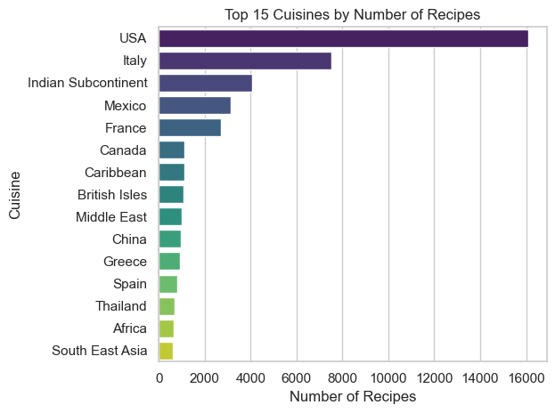
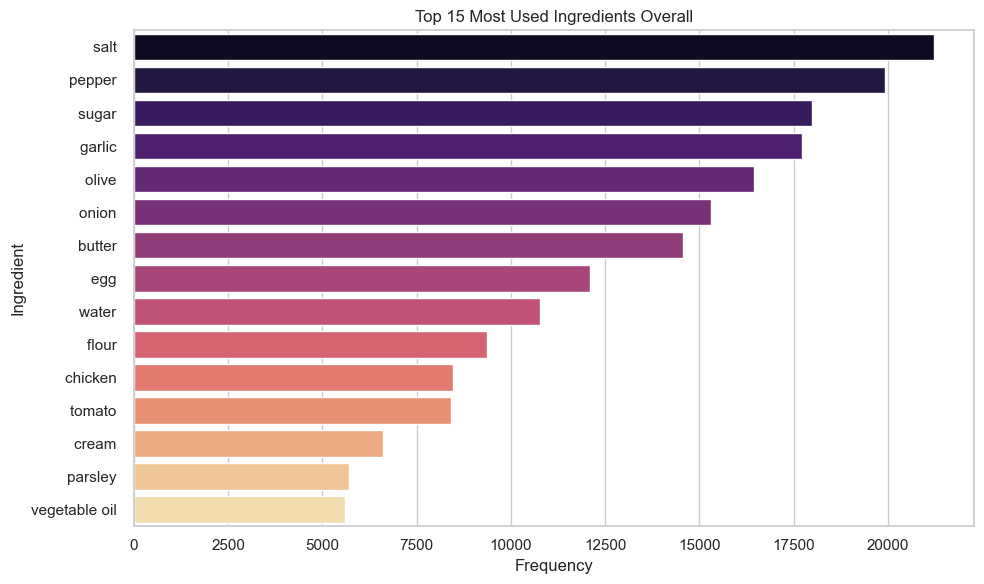
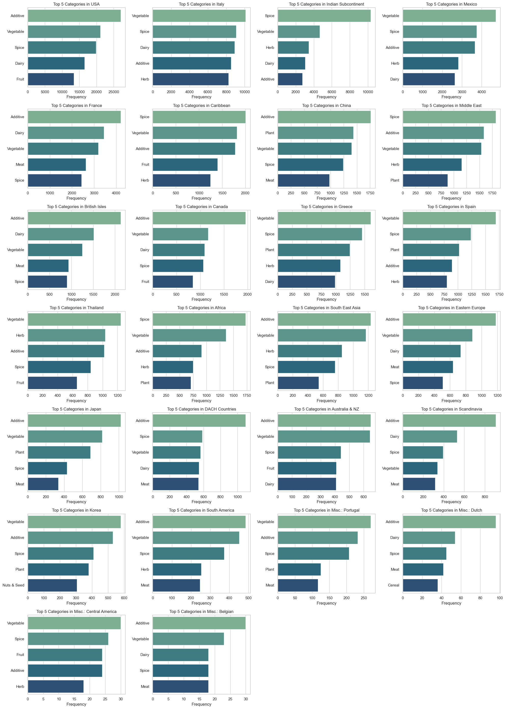
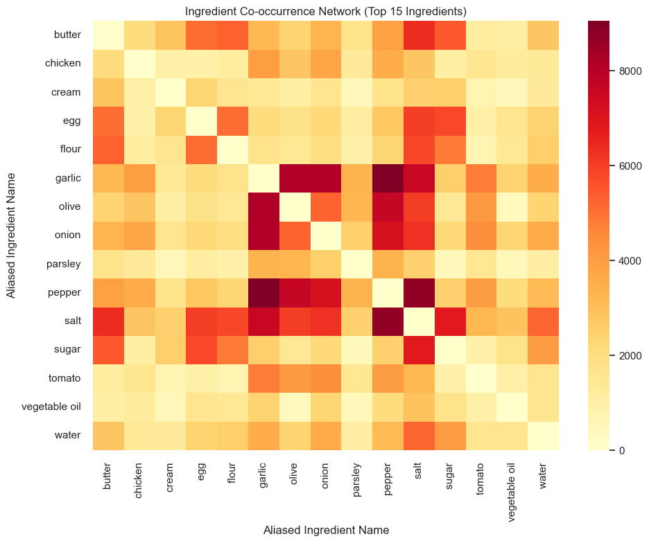
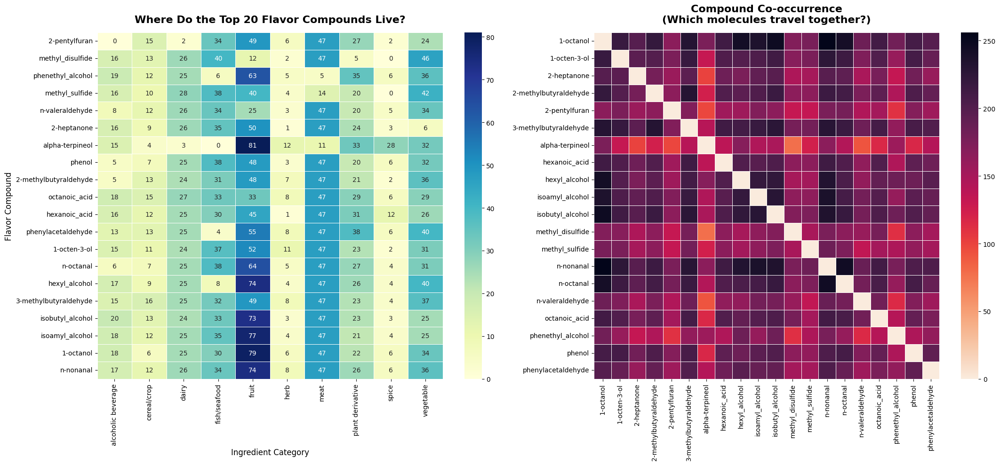
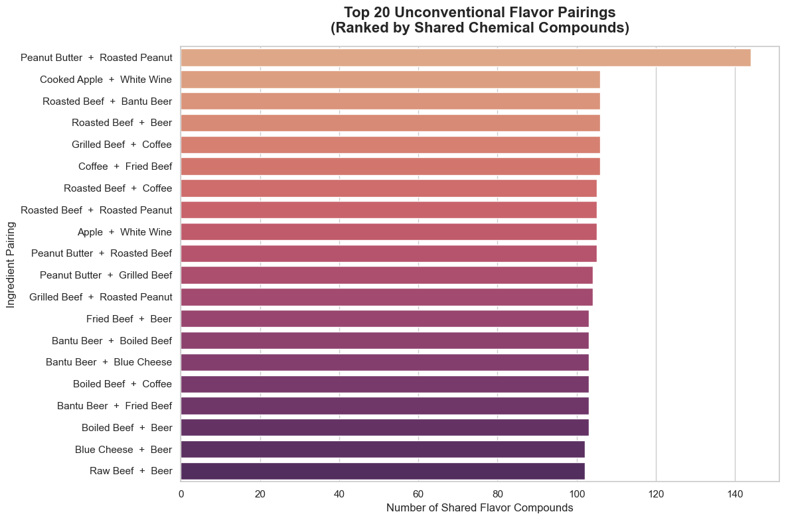

## Milestone 1

### Dataset

> Find a dataset (or multiple) that you will explore. Assess the quality of the data it contains and how much preprocessing / data-cleaning it will require before tackling visualization. We recommend using a standard dataset as this course is not about scraping nor data processing.
>
> Hint: some good pointers for finding quality publicly available datasets ([Google dataset search](https://datasetsearch.research.google.com/), [Kaggle](https://www.kaggle.com/datasets), [OpenSwissData](https://opendata.swiss/en/), [SNAP](https://snap.stanford.edu/data/) and [FiveThirtyEight](https://data.fivethirtyeight.com/)).

## Problematic

### General Topic and Main Axis:
Food science is dictated by chemistry. We want to find the relationships between ingredients that create tasty flavor combinations, and compare it across cultures.

#### What am I trying to show with my visualization? 
We want to show how ingredients are linked chemicaly, and what this tells us on flavor combinations. This will help us find hidden links between seemingly unrelated foods and pattern variations between different cultures. In a second time, we want to suggest science-based recipes that match certain flavor profiles.

### Motivation and Target Audience:

##### Motivation: 
While taste preferences are subjective, we want to show the underlying science that make a dish unequivocaly tasty to the human palate. On a personal note, we are curious to explore how gaining some knowledge about the science behind food can hopefully improve our cooking.

#### Target Audience:
##### General Public: 
The amateur cook can improve his skills and understanding of food science, or at the very least come to think of original ways to combine their leftovers for a satisfying meal. 

##### Chefs : 
New tasty flavors combinations is one of the reasons that can make a restaurant stand out. Understanding the science behind food is essential to this end.

### Exploratory Data Analysis

We did some analysis on the datasets we have and plotted some graphs to get some insights about things like which ingredients are the most used in the dataset as a whole and in each country individually, which category of ingredients are the most used in each country, which ingredients are most often paired together, which compounds appear the most together, and even the top 20 pairings of foods following the flavor network theory. We put some of the graphs under this text and you can see all of our code at [recipes dataset analysis](../data_analysis/recipes_around_the_world.ipynb) and [molecular composition datasets](../data_analysis/molecular_cuisine.ipynb).

### Related work

#### What others have already done with the data?
In 2011, the Ahn et al. Flavor Network dataset was released. Researchers used the data to test the food pairing hypothesis, discovering a cultural divide between Western cuisines, where they typically pair ingredients sharing many flavor compounds, and East Asian cuisines, where they avoid these overlap in favor of constrasting flavors.
Later on, platforms like FlavorDB and CulinaryDB used this data to create text-based search engines where users can look up an ingredient and read a flat list of its chemical compounds. Machine learning engineers have also used the data to train algorithms that predict a recipe's country of origin based on its ingredient list.

#### Why is your approach original?
Our approach is original because it will bridge the gap between academic chemistry and cooking through interactive visualizations. Instead of presenting a network graph, we will clarify the molecular relationships with a clean bipartite graph, placing ingredients on the left and chemical compounds on the right. We will also introduce a more interactive aspect through interesting visualizations such as maps and graphs.

#### What source of inspiration do you take?
Our primary sources of inspiration are directly from the Ahn and al. flavor network repository and the mathematical foundation behind the Food Pairing Hypothesis. We were also insprired by the data structures found in platforms like FlavorDB and CulinaryDB. We think these databases are really cool and offer incredible depths of information regarding recipe compositions, we didn't find them really interactive and user-friendly.
Beyond these academic and technical sources, our inspiration is also personal motivation, with the desire to better match ingredients with the kitchen and leverage the versatility of ingredients.
