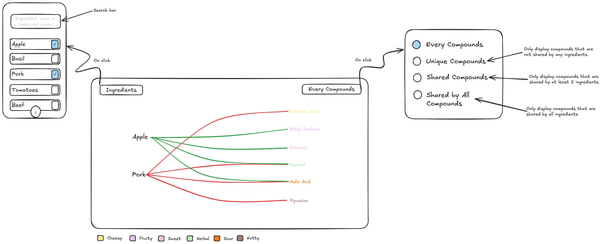
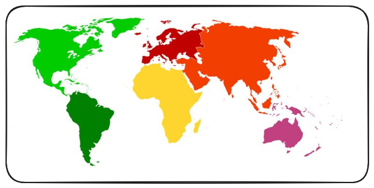
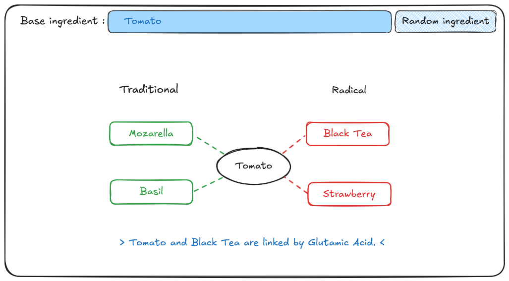

# Milestone 2 (Friday 1st May, 5pm)
10% of the final grade

Two A4 pages describing the project goal.

• Include sketches of the vizualiation you want to make in your final product.

• List the tools that you will use for each visualization and which (past or future)
lectures you will need.

• Break down your goal into independent pieces to implement. Try to design a
core visualization (minimal viable product) that will be required at the end.
Then list extra ideas (more creative or challenging) that will enhance the
visualization but could be dropped without endangering the meaning of the
project

Functional project prototype review.

• You should have an initial website running with the basic skeleton of the
visualization/widgets

## Sketches

### Visualization 1: Bipartite Graph

- Desciption:  A dual-layered network graph. The left axis contains nodes representing ingredients (e.g., Tomato, Basil), and the right axis contains nodes representing hidden chemical compounds (e.g., Linalool). Edges connect ingredients to their constituent compounds. Clicking an ingredient highlights its specific chemical makeup and traces lines back to unexpected ingredients that share those exact compounds.
- Tools needed: The primary tool needed will be the D3.js library especially its focus on making graphs. 
- Lectures needed: Lecture: D3.js, Lecture: Interactions, Lecture: Graphs

### Visualization 2: Interactive Map

- Description: An interactive world map serving as the gateway to global recipes. Users can click on a continent, zoom into a specific region, and select traditional recipes. Once a recipe is selected, the visualization dynamically morphs to show the internal chemical network of that specific dish.
- Tools needed: The visualization will require a combination of D3.js and specialized geographic data formats, such as TopoJSON or GeoJSON. The d3-geo module will be used for rendering the interactive world map, handling the mathematical projections required to display the globe on a flat screen, and managing the zoom and pan interactivity when a user selects a specific continent or country. Once a region is clicked and a recipe is chosen, we will transition to standard D3 SVG drawing techniques to render the localized recipe sub-graphs using our merged data.
- Lectures needed : Lecture: D3.js, Lecture: Interactions, Lecture: Maps

### Visualization 3: Ingredients Search Bar

- Description: A research bar interface where users search for a specific ingredient (autocompleted with the user's input). The visualization outputs the most traditional pairings (e.g Tomato with Mozarella) or the most unconventional pairings (e.g Tomato with Black Tea)
- Tools needed: This visualization will heavily rely on vanilla JavaScript. We will then use D3.js to show bubbles with the compounds.
- Lectures needed: Lecture: D3.js, Lecture: Interactions, Lecture: JavaScript part 1 and part 2
